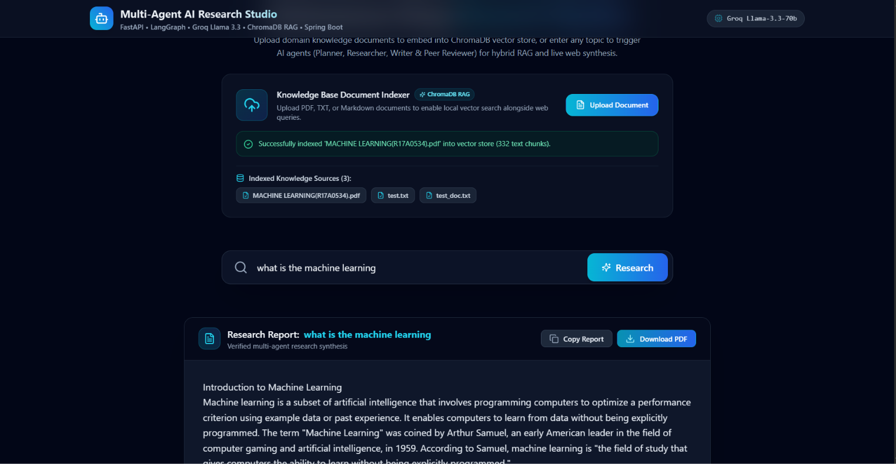

# Multi-Agent Deep Research Assistant Studio 🤖🔍

[](LICENSE)
[](https://spring.io/projects/spring-boot)
[](https://fastapi.tiangolo.com/)
[](https://langchain-ai.github.io/langgraph/)
[](https://qdrant.tech/)
[](https://groq.com/)

An autonomous, enterprise-grade **Multi-Agent Deep Research Assistant System** powered by **FastAPI**, **LangGraph**, **Groq (Llama 3.3 70B)**, **Qdrant Vector RAG**, **Spring Boot 3**, **Redis**, and a **React UI**. 

Users can input any research topic or upload custom knowledge documents (PDF, TXT, MD) to trigger a team of specialized AI agents (Planner, Researcher, Writer, and Peer Reviewer) to synthesize live, structured research reports in real time.

---

## 🏗️ System Architecture

```
                                 ┌───────────────────────────┐
                                 │     React 18 Dashboard    │
                                 │    (Tailwind CSS + SSE)   │
                                 └─────────────┬─────────────┘
                                               │
                                   HTTP / SSE  │  Port 3000 / 8080
                                               ▼
                                 ┌───────────────────────────┐
                                 │    Spring Boot Gateway    │
                                 │  (Redis Pub/Sub & Cache)  │
                                 └─────────────┬─────────────┘
                                               │
                                   REST API    │  Port 8000
                                               ▼
                                 ┌───────────────────────────┐
                                 │   FastAPI Python AI Engine│
                                 │    (LangGraph Workflow)   │
                                 └──────┬─────────────┬──────┘
                                        │             │
                    Semantic Retrieval  │             │ Live Search
                                        ▼             ▼
                        ┌──────────────────┐    ┌─────────────┐
                        │  Qdrant Vector   │    │ DuckDuckGo  │
                        │ Knowledge Store  │    │ Web Search  │
                        └──────────────────┘    └─────────────┘
```

---

## ✨ Key Features

- **🤖 Multi-Agent LangGraph Pipeline**:
  - **Planner Agent**: Generates a 3-point structured outline for targeted research.
  - **Researcher Agent (Hybrid RAG)**: Queries **Qdrant** vector store for custom document chunks alongside live **DuckDuckGo** web search.
  - **Writer Agent**: Synthesizes all gathered evidence and previous review feedback into markdown reports using **Groq Llama 3.3 70B**.
  - **Peer Reviewer Agent**: Evaluates report quality and loops back for revisions if required (max 2 revision passes).
- **📚 Retrieval-Augmented Generation (RAG)**:
  - Drag-and-drop file uploader supporting **PDF, TXT, and Markdown** files.
  - Generates 384-dimensional vector embeddings powered by **Hugging Face Cloud Inference API** (`BAAI/bge-small-en-v1.5` or `all-MiniLM-L6-v2`) with automatic fallback to local CPU execution.
  - Persistent Qdrant storage under `ai-engine/data/qdrant_db` (or remote Qdrant Cloud cluster via `QDRANT_URL`).
  - On-demand **"Clear Knowledge Base"** action to reset vector indexes.
- **⚡ Real-Time Progress Streaming (SSE)**:
  - Agent progress and state transitions are broadcast in real-time to the React dashboard using **Redis Pub/Sub** and **Server-Sent Events (SSE)**.
- **⚡ High-Performance Caching**:
  - Spring Boot checks **Redis** for previous research reports (24-hour cache TTL) to deliver instant results on duplicate queries.
- **🎨 Glassmorphic React UI**:
  - Built with React 18, Vite, and Tailwind CSS.
  - Features real-time agent status cards, markdown rendering, outline navigation, and PDF export functionality.

---

## 🛠️ Technology Stack

| Layer | Technologies Used |
| :--- | :--- |
| **Frontend** | React 18, Vite, Tailwind CSS, Lucide React, Axios, html2pdf.js |
| **Backend Gateway** | Java 17, Spring Boot 3.2, Spring Data Redis, Lombok, RestTemplate, SseEmitter |
| **AI / Microservice** | Python 3.11, FastAPI, LangGraph, LangChain, Groq API (Llama 3.3 70B), Pydantic |
| **Vector DB / RAG** | Qdrant (`qdrant-client`), Hugging Face Inference API (`BAAI/bge-small-en-v1.5`), `pypdf`, `langchain-text-splitters` |
| **Caching & Pub/Sub**| Redis 7 (Alpine) / Upstash Redis |
| **Containerization** | Docker & Docker Compose |

---

## 📁 Repository Structure

```
multi-agent-system/
├── ai-engine/                  # Python FastAPI AI Microservice
│   ├── app/
│   │   ├── agents/             # LangGraph agent node logic (Planner, Researcher, Writer, Reviewer)
│   │   ├── graph/              # LangGraph state graph definitions
│   │   ├── rag/                # Qdrant vector store engine & Hugging Face embeddings
│   │   ├── tools/              # Search (DuckDuckGo) & Redis event publisher tools
│   │   ├── config.py           # Environment variables (Groq & HF keys)
│   │   └── main.py             # FastAPI entry point & API endpoints
│   ├── data/                   # Persistent Qdrant vector storage
│   ├── Dockerfile
│   └── requirements.txt
├── backend-gateway/            # Spring Boot Microservice Gateway
│   ├── src/main/java/com/agent/researcher/
│   │   ├── config/             # Redis & CORS security configuration

│   │   ├── controller/         # Research REST endpoints & SSE controller
│   │   ├── dto/                # Request / Response Data Transfer Objects
│   │   └── service/            # Business logic, Redis caching, & Python proxy
│   ├── Dockerfile
│   └── pom.xml
├── frontend/                   # React 18 Single-Page Dashboard
│   ├── src/
│   │   ├── components/         # SearchBar, DocumentUploader, LoadingIndicator, ReportDisplay
│   │   ├── services/           # Axios API client & SSE streaming
│   │   ├── App.jsx
│   │   └── main.jsx
│   ├── Dockerfile
│   └── package.json
└── docker-compose.yml          # Multi-container orchestrator
```

---

## ⚙️ Environment Configuration

Create a `.env` file in the `ai-engine/` directory:

```bash
# ai-engine/.env

# Groq API Key (Required for Llama 3.3 70B LLM synthesis)
GROQ_API_KEY=gsk_your_groq_api_key_here

# Hugging Face Token (Optional: Enable Cloud Inference API for Embeddings)
HF_TOKEN=hf_your_hugging_face_token_here

# Embedding Model (Optional: Default is BAAI/bge-small-en-v1.5)
HF_EMBEDDING_MODEL=BAAI/bge-small-en-v1.5
```

---

## 🚀 Quick Start Guide

### Option 1: Running with Docker Compose (Recommended)

1. Ensure Docker Desktop is installed and running.
2. Clone the repository:
   ```bash
   git clone https://github.com/Vansh-2102/Multi-Agent-Research-Assistant.git
   cd Multi-Agent-Research-Assistant
   ```
3. Set your API keys in `ai-engine/.env`.
4. Start all microservices in containerized mode:
   ```bash
   docker compose up --build -d
   ```
5. Access the application in your browser at **`http://localhost:3000`**.

---

### Option 2: Running Locally (Development Mode)

#### 1. Start Redis
```bash
docker run -d --name redis -p 6379:6379 redis:7-alpine
```

#### 2. Start Python AI Engine
```bash
cd ai-engine
pip install -r requirements.txt
uvicorn app.main:app --reload --host 0.0.0.0 --port 8000
```

#### 3. Start Spring Boot Gateway
```bash
cd backend-gateway
./mvnw spring-boot:run
```

#### 4. Start React UI
```bash
cd frontend
npm install
npm run dev
```

---

## 📡 API Endpoints Summary

### Spring Boot Gateway (`http://localhost:8080/api/v1/research`)
- `POST /` — Triggers research workflow or retrieves cached Redis report.
- `POST /upload` — Accepts `multipart/form-data` file uploads (PDF, TXT, MD) and proxies to Python AI Engine.
- `DELETE /clear-docs` — Clears all indexed knowledge documents from ChromaDB.
- `GET /indexed-docs` — Fetches a list of currently indexed document source names.
- `GET /stream/{topic}` — SSE endpoint for real-time agent status event streaming.

### Python AI Engine (`http://localhost:8000`)
- `POST /run-research` — Invokes LangGraph agent execution graph.
- `POST /upload-doc` — Extracts text, chunks documents, generates embeddings, and indexes into ChromaDB.
- `DELETE /clear-docs` — Resets persistent ChromaDB vector store collection.
- `GET /indexed-docs` — Returns unique list of indexed documents.

---

## 📄 License

Distributed under the MIT License. See `LICENSE` for more information.


